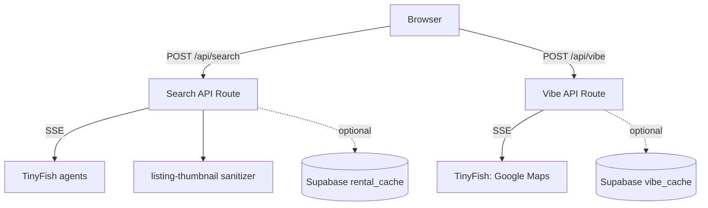

# District Rent Shark

> English-first apartment hunting in Vietnam. Scrapes Chợ Tốt and batdongsan.com.vn using TinyFish browser agents, with trust scoring, building rules, and neighborhood vibe data from Google Maps.

**Live demo → [district-rent-shark.vercel.app](https://district-rent-shark.vercel.app)**

---

## What it does

Finding apartments in Vietnam means visiting several websites, each with different layouts, Vietnamese-only listings, and no easy way to compare prices or trust signals. This app sends TinyFish browser agents to Chợ Tốt and batdongsan.com.vn **in parallel**, extracts structured rental data with English translations, and streams results to the dashboard in real time.

- Search across **3 cities** — HCMC, Hanoi, Da Nang (up to **4 parallel city slots** in the UI)
- **Trust scoring** — brokers, suspicious pricing, and related signals (`src/lib/normalize.ts`)
- **Building rules** — pets, parking, curfew, and notes from listings
- **Neighborhood vibe** — Google Maps–driven summaries per district (`/api/vibe`)
- **Mapbox** — optional map when `NEXT_PUBLIC_MAPBOX_TOKEN` is set
- Toggle **live scraping** vs **cached results** (6-hour TTL in Supabase)
- **Thumbnails** — after extraction, `src/lib/listing-thumbnail.ts` merges `thumbnail_url`, `thumbnail_candidates`, nested image fields, and URLs found in text, picks the best property image (not poster avatars when alternatives exist), and upgrades small `/resize/` CDN paths when possible
- Results stream over **SSE** as each site finishes

---

## Demo


---

## How it works

```
User clicks Search
       │
       ▼
POST /api/search  { city, useCache? }
       │
       ├── Cache hit? → stream LISTING_RESULT immediately (payload run through thumbnail sanitizer)
       │
       └── Cache miss? → TinyFish agent.stream per site URL (parallel)
                              │
                              ├── STREAMING_URL → client can show live browser preview iframes
                              │
                              └── COMPLETE → JSON sanitized (thumbnails) → LISTING_RESULT → optional cache upsert
```

Each city targets **two** listing URLs (Chợ Tốt + batdongsan). The API uses the **Node.js** runtime with a long timeout so agents can finish. Optional `TINYFISH_FETCH_FIRST_PIPELINE=1` enables a fetch-then-extract path before falling back to the streaming agent.

---

## TinyFish SDK (search route)

The search handler uses `@tiny-fish/sdk` with stealth browser profile and proxy enabled (see `src/app/api/search/route.ts`). Events include `STREAMING_URL` (with `siteUrl` + `streamingUrl`) and `COMPLETE` with structured listing JSON. Listing payloads are passed through `sanitizeListingResultThumbnails()` before being sent to the client or cached.

---

## Running locally

```bash
git clone https://github.com/tinyfish-io/tinyfish-cookbook
cd tinyfish-cookbook/district-rent-shark
npm install
```

Create a `.env.local` file:

```env
# Required
TINYFISH_API_KEY=your_key_here

# Optional
NEXT_PUBLIC_MAPBOX_TOKEN=your_mapbox_token
NEXT_PUBLIC_SUPABASE_URL=your_supabase_url
SUPABASE_SERVICE_ROLE_KEY=your_service_role_key

# Optional — use fetch → LLM extract before full browser agent (see route)
# TINYFISH_FETCH_FIRST_PIPELINE=1
```

Get a TinyFish API key at [tinyfish.ai](https://tinyfish.ai/). Supabase is only needed for caching; search works without it.

```bash
npm run dev
```

Open [http://localhost:3000](http://localhost:3000).

---

## Architecture



---

## Tech stack

| Layer | Choice | Notes |
| --- | --- | --- |
| Framework | Next.js 16 (App Router) | API routes use `nodejs` runtime for SSE |
| UI | React 19 + Tailwind CSS 4 + shadcn/ui | |
| Scraping | [TinyFish API](https://tinyfish.ai/) | `@tiny-fish/sdk` |
| Mapping | Mapbox GL | Optional (`NEXT_PUBLIC_MAPBOX_TOKEN`) |
| Env validation | Zod | `src/lib/env.ts` for optional strict Supabase env |
| Caching | Supabase (Postgres) | Graceful degradation if unset |
| Testing | Vitest | Parsing, trust scoring, thumbnail selection |

---

## Scripts

| Command | Description |
| --- | --- |
| `npm run dev` | Development server |
| `npm run build` | Production build |
| `npm run start` | Run production server |
| `npm test` | Vitest |
| `npm run lint` | ESLint |

---

Built as a demo for [TinyFish](https://tinyfish.ai) — parallel browser agents on local listing sites with a streamed English-first UI.
